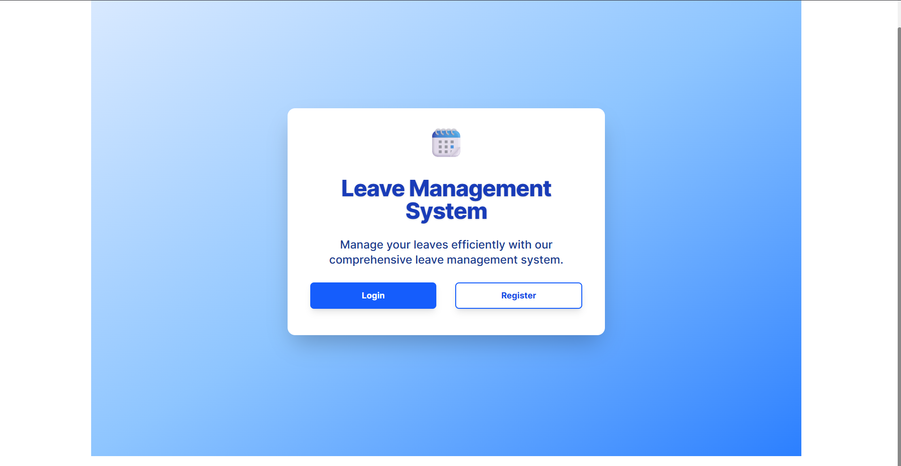

# Smart Leave Management System

A full-stack MERN application for managing employee leaves with role-based access for Admin, Manager, and Employee. The backend is built with Node.js, Express, and MySQL, while the frontend uses React and Vite. The app is deployed with the backend on Render, MySQL on Railway, and the frontend on Netlify.

---

## Live Demo

- **Frontend (Netlify):**https://smartleavemanagement.netlify.app/
- **Backend (Render):** https://smart-leave-management-system.onrender.com
- **Github:**https://github.com/Shivam24S/smart-leave-management-system

---

## Quick Role-Based Login Credentials

| Role     | Email                  | Password               |
| -------- | ---------------------- | ---------------------- |
| Admin    | Admin1@gmail.com       | Admin1@gmail.com       |
| Employee | Usercheck1@gmail.com   | Usercheck1@gmail.com   |
| Manager  | managercheck@gmail.com | managercheck@gmail.com |

---

## Features

- **Role-Based Authentication:** Admin, Manager, Employee
- **Leave Application & Approval:** Employees can apply for leave, managers can approve/reject
- **User Management:** Admin can manage users and view audit logs
- **Leave Balances:** Track and display leave balances
- **Audit Logs:** Admin can view all system actions
- **Responsive UI:** Built with React, Vite, and Tailwind CSS

---

## Project Structure

```
Smart Leave Management System/
├── backend/
│   ├── app.js
│   ├── server.js
│   ├── config/
│   ├── controllers/
│   ├── middlewares/
│   ├── models/
│   ├── routes/
│   ├── services/
│   ├── utils/
│   └── validation/
├── frontend/
│   ├── src/
│   ├── public/
│   ├── index.html
│   ├── package.json
│   └── ...
└── README.md
```

---

## Getting Started (Local Setup)

### Prerequisites

- Node.js (v16+)
- MySQL

### 1. Clone the Repository

```bash
git clone <repo-url>
cd "Smart Leave Management System"
```

### 2. Backend Setup

```bash
cd backend
npm install
npm start
```

### 3. Frontend Setup

```bash
cd frontend
npm install
npm run dev
```

---

## Environment Variables

### Backend (`backend/.env`)

```
DB_HOST=mysql.railway.internal
DB_USER=your_mysql_user
DB_PASSWORD=your_mysql_password
DB_NAME=your_db_name
JWT_SECRET=your_jwt_secret
```

### Frontend (`frontend/.env`)

```
VITE_API_BASE_URL=https://smart-leave-management-system.onrender.com/api
```

---

## API Endpoints

- `/api/auth` - Authentication routes
- `/api/admin` - Admin routes
- `/api/employee` - Employee routes
- `/api/manager` - Manager routes

---

## Tech Stack

- **Frontend:** React, Vite, Tailwind CSS
- **Backend:** Node.js, Express
- **Database:** MySQL (Railway)
- **Deployment:** Render (backend), Netlify (frontend), Railway (MySQL)

---


